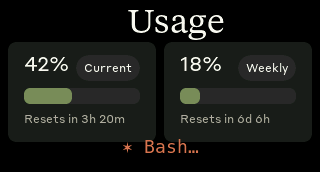

# Clawdmeter — 微雪 ESP32-S3-LCD-1.47 横屏移植

把 [Clawdmeter](https://github.com/HermannBjorgvin/Clawdmeter) 移植到
**微雪 ESP32-S3-LCD-1.47**（ST7789V 172×320 SPI），**横屏（320×172）** 摆放。
屏上实时显示你的 Claude Code 用量，**以及 Claude 此刻在干什么**——用 Clawd 像素动画表现。

> English: [README.md](README.md)

| 用量 | 敲代码 | 思考 | 空闲 |
|:---:|:---:|:---:|:---:|
|  |  |  |  |

## 功能
- **用量页** — 5 小时 / 7 天限额百分比、进度条、重置倒计时。
- **实时工作状态（核心亮点）** — Clawd 动画实时反映 Claude 在干嘛：

  | Claude 在… | Clawd 就… |
  |---|---|
  | 空闲 | 睡觉 |
  | 思考 | 托腮思考 |
  | Bash / Edit / Write | 敲代码 |
  | Read / Grep / Glob | 思考（读取=理解） |
  | WebFetch / WebSearch | 惊讶（联网） |
  | Task（子任务） | 蹦迪 |

- **屏幕常亮**，数据走 **USB 串口**（无需蓝牙配对）。

## 硬件
- **微雪 ESP32-S3-LCD-1.47**：ST7789V 172×320、ESP32-S3R8、8MB PSRAM、16MB flash、USB-A 直插。
- 屏幕引脚：`MOSI=45 SCLK=40 CS=42 DC=41 RST=39 BL=48`，背光 PWM。
- **横屏** 摆放（USB-A 横向）→ `display rotation=3`
  （在 `firmware/src/boards/waveshare_lcd_147/display.cpp`；上下颠倒就改成 `1`）。

## 编译（云端，推荐）
本板是一个 PlatformIO env。push 触发 GitHub Actions，你只负责烧录。

```yaml
# 仓库已自带：.github/workflows/build-lcd147.yml
- run: pip install --upgrade platformio
- run: pio run -d firmware -e waveshare_lcd_147
```

产物：`firmware/.pio/build/waveshare_lcd_147/firmware.bin`。
（本地编译同一行 `pio run`，需 PlatformIO，首次约 4 分钟。）

## 烧录
```bash
# 单固件
esptool --port /dev/ttyACM0 --baud 921600 write-flash 0x10000 firmware.bin

# 或烧 app1 槽（双 OTA，保留 app0 原有固件）
esptool --port /dev/ttyACM0 --baud 921600 write-flash 0x310000 firmware.bin
```
> 固件是 IDF5（pioarduino）。实测 IDF4 的旧 bootloader 也能启动它，所以只烧 app（不烧 0x0）通常就行。

## 主机侧 — 给屏幕喂数据
全部在 [`host/`](host/)，三个小件：

**1. 用量** — 把 Claude Code 的 statusLine 指向 `claude-usage-statusline.sh`
（它写 `~/.cache/claude-usage.json`）。在 `~/.claude/settings.json`：
```json
"statusLine": { "type": "command", "command": "bash /path/to/host/claude-usage-statusline.sh" }
```
> 已经用了别的 statusLine（比如某个 HUD 插件）？别替换——写个小 wrapper 把 stdin
> 分给两个，statusLine 指向 wrapper：
> ```bash
> input=$(cat)
> printf '%s' "$input" | bash /path/to/host/claude-usage-statusline.sh >/dev/null 2>&1
> printf '%s' "$input" | bash /path/to/你原来的-statusline.sh
> ```

**2. 工作状态** — 把 `claude-activity-hook.sh` 挂到 `settings.json` 的 hooks：
```json
"hooks": {
  "UserPromptSubmit": [ { "hooks": [ { "type":"command","command":"bash /path/to/host/claude-activity-hook.sh" } ] } ],
  "PreToolUse":  [ { "matcher":"*", "hooks": [ { "type":"command","command":"bash /path/to/host/claude-activity-hook.sh" } ] } ],
  "Stop":        [ { "hooks": [ { "type":"command","command":"bash /path/to/host/claude-activity-hook.sh" } ] } ]
}
```

**3. 发送器** — `claude-clawd-sender.py` 读两个 cache，每 2 秒往串口发一行 JSON。
```bash
pip install pyserial
python3 host/claude-clawd-sender.py          # 默认 CLAWD_PORT=/dev/ttyACM0
```
或装成服务：改 `host/claude-clawd.service` 里的 `User`/路径，然后
`sudo cp host/claude-clawd.service /etc/systemd/system/ && sudo systemctl enable --now claude-clawd`。

## 数据流
```
Claude Code --statusLine--> ~/.cache/claude-usage.json    --+
            --hooks-------> ~/.cache/claude-activity.json  --+
                                                             +-- sender(2s) --串口--> ESP32
ESP32：解析 JSON -> LVGL 用量页 + Clawd 工作状态动画
```

## 串口协议（板子侧）
115200，一行 JSON，例如：
```json
{"s":42,"sr":200,"w":18,"wr":9000,"st":"allowed","ok":true,"act":"Bash"}
```
`s`/`w`=会话/周用量%，`sr`/`wr`=距重置分钟数，`act`=当前活动。
板子也接受纯命令：`scr usage`、`scr splash`、`screenshot`。

## 致谢
移植自 [Clawdmeter](https://github.com/HermannBjorgvin/Clawdmeter)（作者 HermannBjorgvin）。
Clawd 像素动画来自 claudepix。上游仓库有版权说明（专有字体 / 吉祥物），本移植同样适用。
